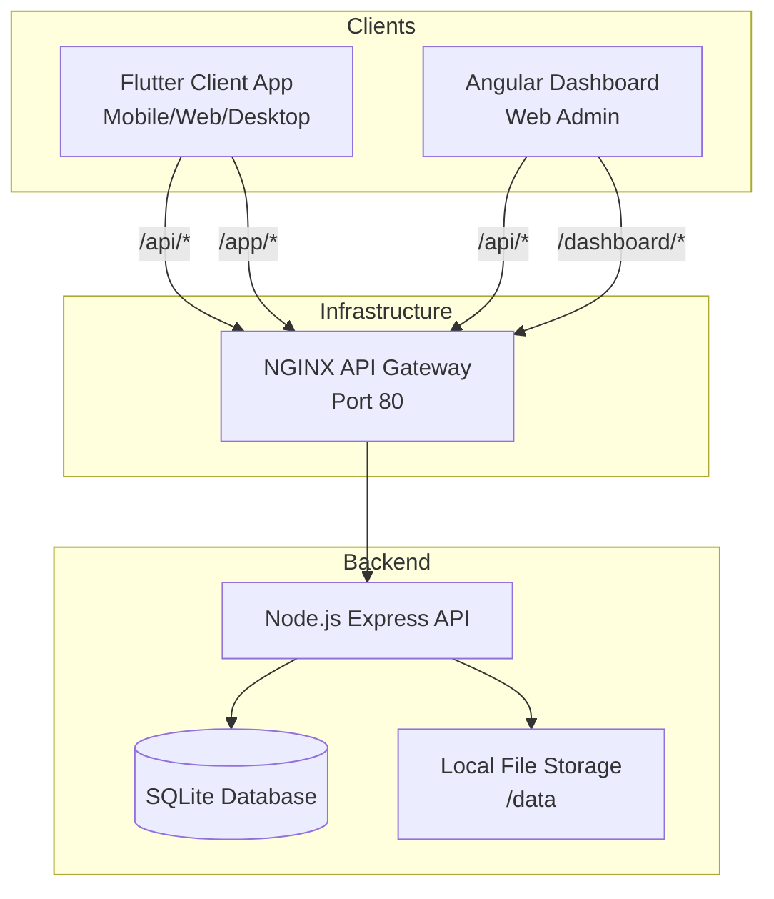

# Vibes

A modern, private media ecosystem featuring a TikTok-style vertical scrolling video player app, an Angular web dashboard, and a Node.js backend.

## System Architecture

The ecosystem consists of independent components that communicate seamlessly through an API Gateway:

- **API Gateway**: NGINX acts as a reverse proxy, routing requests based on paths (`/api`, `/app`, `/dashboard`).
- **Backend API**: The Node.js server handles authentication, media streaming, and metadata.
- **Clients**: Both the Flutter application and Angular dashboard interact directly with the API Gateway.

## Supported Platforms

The Flutter application (`app/`) is cross-platform and supports the following environments:
- **Mobile**: Android, iOS
- **Web**: Chrome, Safari, Firefox, Edge
- **Desktop**: macOS, Windows, Linux

## Project Structure

This repository is organized into four main components:

- **`app/`**: A Flutter application designed for a modern video viewing experience with vertical scrolling, likes, and notes.
- **`dashboard/`**: An Angular-based web administration dashboard for content management and uploads.
- **`server/`**: A robust Node.js Express API using `better-sqlite3` and JWT authentication to securely serve private media and handle metadata.
- **`infra/`**: Docker and Docker Compose configuration files containing an API Gateway and deployment configurations.

## Getting Started

### Local Development Setup
If you wish to run the components independently for development, check the README inside each respective folder:
- [Backend Server (Node.js)](server/README.md)
- [Admin Dashboard (Angular)](dashboard/README.md)
- [Video Feed App (Flutter)](app/README.md)

### Deployment (Docker)
The easiest way to get the entire ecosystem running seamlessly is using the provided Docker Compose configuration in the `infra` folder. This uses an NGINX API Gateway to serve everything on a single port (Port 80).

Read the [Infra Deployment Guide](infra/README.md) for full instructions on how to deploy this stack from scratch.
